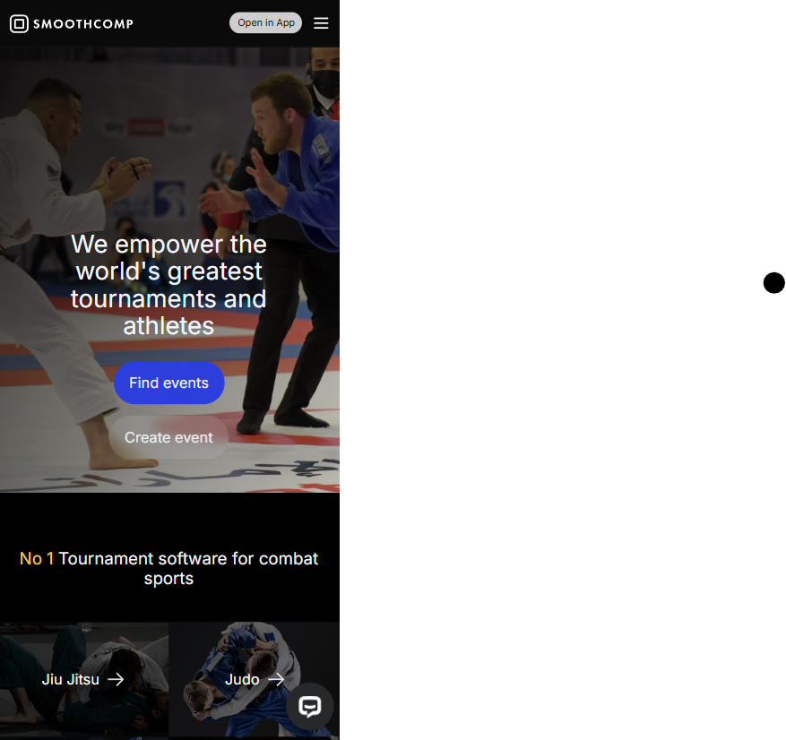
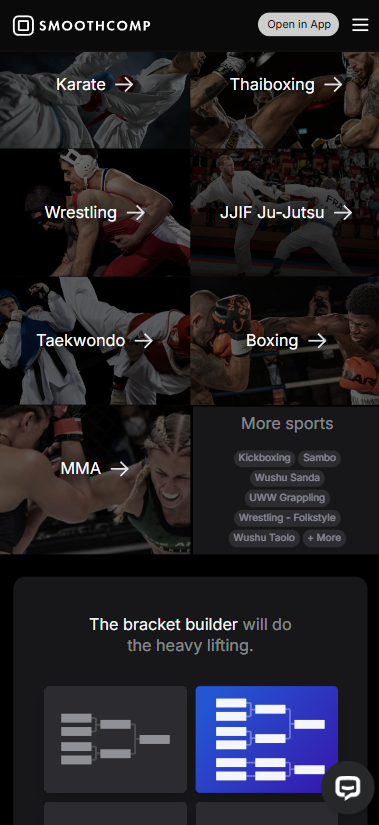
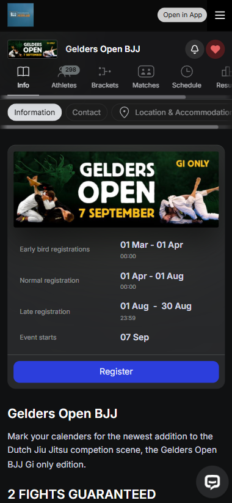
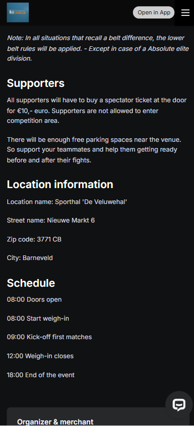

# Procesverslag
Markdown is een simpele manier om HTML te schrijven.  
Markdown cheat cheet: [Hulp bij het schrijven van Markdown](https://github.com/adam-p/markdown-here/wiki/Markdown-Cheatsheet).

Nb. De standaardstructuur en de spartaanse opmaak van de README.md zijn helemaal prima. Het gaat om de inhoud van je procesverslag. Besteedt de tijd voor pracht en praal aan je website.

Nb. Door *open* toe te voegen aan een *details* element kun je deze standaard open zetten. Fijn om dat steeds voor de relevante stuk(ken) te doen.

## Jij

  
uitwerken voor kick-off werkgroep

  ### Auteur:
  Elif Yildirim

  #### Je startniveau:
  Blauw/rood

  #### Je focus:
Responsive (en surface plane als er tijd voor is) 

## Je website

  
uitwerken voor kick-off werkgroep

  ### Je opdracht:
    https://smoothcomp.com/en
  #### Screenshot(s) van de eerste pagina (small screen): 
    Home pagina
 Hier is content met linkjes naar andere pagina's
 

  #### Screenshot(s) van de tweede pagina (small screen):
    Detail pagina
 Hier begint de detail pagina
 Hier is wat tekst

## Toegankelijkheidstest 1/2 (week 1)

  
uitwerken na test in 2e werkgroep

  ### Bevindingen
  
  Mijn bevindingen die in de toegankelijkheidstest naar voren kwamen: 
  - Screanreader ging makkelijk aan. De toetsen die je moet gebruiken zijn makkelijk te vinden en begrijpen.
  - De stem van de screenreader is prima te volgen. 
  - De screenreader pakt alle headings en linkjes op de juiste volgorde. Als ik op 1 klik pakt die alle H1's en als ik 2 of 3 klik leest die de juiste bijhorende headings voor. 
  - Bij images zegt die unlabed graphic, dus de images hebben geen alt tekst waardoor ze niet toegankelijk zijn voor de screenreader. 
  - De screenreader geeft aan wanneer het een link is.
  
 Mijn bevindingen die in de WCAG checklist naar voren kwamen: 
  - De content van de website is makkelijk te begrijpen. Het is duidelijk dat de buttons buttons zijn. De screenreader laat goed weten wanneer iets een link is.
  - Bij het valideren van de code komen er veel errors uit. De site heeft een lang attribute en je kan de site overschakelen naar verschillende talen. De pagina's hebben geen unieke titel, tenminste er stond (toen ik het opzocht) aria-label: not specified. 
  - Bij tab en shift-tab is er een visuele element die zichbaar wordt.
  - De site kan geroteerd worden naar verschillende angles en de links hebben een goeie grootte en positie. 
  - De site heeft alleen maar div's. Geen lists. De headings staan elke keer bovenaan de div, dus heeft een logische volgorde. Het heeft op de home pagina twee H1's. 
  - De images hebben geen alt attribute. Het heeft geen text alternative voor complexere foto's. Er zijn twee images die tekst bevatten en die als button worden weergegeven, deze hebben wel een alt-text. 
  - De site heeft 1 video zonder audio. Het speelt automatisch. Je kan hem niet pauzeren of stoppen. 
  - De links hebben een a element. De links hebben een focus state. Sommige buttons hebben geen button element. De links hebben een icoon die verwijst dat je naar een andere pagina verstuurd gaat worden.
  - Ze gebruiken wel kleur, maar ze gebruiken ook veel vormen, plaatjes en tekst voor de informatie. Er is alleen een dark mode. 
  - Het heeft 1 animatie onderaan met de logo's van hun partners. Het is subtiel, maar ik kan niet vinden of het zich houdt aan de prefers-reduced-motion media query.
  - De color contrast is helemaal goed. 

  Vragen: 
  - "Provide a unique title for each page" -> is dit een H1? 
  - Strong gwbruiken: mag dat of niet?

## Breakdownschets (week 1)

  
uitwerken na afloop 3e werkgroep

  ### de hele pagina: 
  

  ### dynamisch deel (bijv menu): 
  

  ### wellicht nog een dynamisch deel (bijv filter): 
  

## Voortgang 1 (week 2)

  
uitwerken voor 1e voortgang

  ### Stand van zaken
  hier dit ging goed & dit was lastig (neem ook screenshots op van delen van je website en code)

  ### Agenda voor meeting
  samen met je groepje opstellen

  | student 1      | student 2          | student 3    | student 4        |
  | ---            | ---                | ---          | ---              |
  | dit bespreken  | en dit             | en ik dit    | en dan ik dat    |
  | en dat ook nog | dit als er tijd is | nog een punt | dit wil ik zeker |
  | ...            | ...                | ...          | ...              |

  ### Verslag van meeting
  hier na afloop snel de uitkomsten van de meeting vastleggen

  - punt 1
  - punt 2
  - nog een punt
  - ...

## Voortgang 2 (week 3)

  
uitwerken voor 2e voortgang

  ### Stand van zaken
  hier dit ging goed & dit was lastig (neem ook screenshots op van delen van je website en code)

  ### Agenda voor meeting
  samen met je groepje opstellen

  | student 1      | student 2          | student 3    | student 4        |
  | ---            | ---                | ---          | ---              |
  | dit bespreken  | en dit             | en ik dit    | en dan ik dat    |
  | en dat ook nog | dit als er tijd is | nog een punt | dit wil ik zeker |
  | ...            | ...                | ...          | ...              |

  ### Verslag van meeting
  hier na afloop snel de uitkomsten van de meeting vastleggen

  - punt 1
  - punt 2
  - nog een punt
- ...

## Toegankelijkheidstest 2/2 (week 4)

  
uitwerken na test in 9e werkgroep

  ### Bevindingen
  Lijst met je bevindingen die in de test naar voren kwamen (geef ook aan wat er verbeterd is):

## Voortgang 3 (week 4)

  
uitwerken voor 3e voortgang

  ### Stand van zaken
  hier dit ging goed & dit was lastig (neem ook screenshots op van delen van je website en code)

  ### Agenda voor meeting
  samen met je groepje opstellen

  | student 1      | student 2          | student 3    | student 4        |
  | ---            | ---                | ---          | ---              |
  | dit bespreken  | en dit             | en ik dit    | en dan ik dat    |
  | en dat ook nog | dit als er tijd is | nog een punt | dit wil ik zeker |
  | ...            | ...                | ...          | ...              |

  ### Verslag van meeting
  hier na afloop snel de uitkomsten van de meeting vastleggen

  - punt 1
  - punt 2
  - nog een punt
  - ...

## Eindgesprek (week 5)

  
uitwerken voor eindgesprek

  ### Je uitkomst - karakteristiek screenshots:
  

  ### Dit ging goed/Heb ik geleerd: 
  Korte omschrijving met plaatjes

  

  ### Dit was lastig/Is niet gelukt:
  Korte omschrijving met plaatjes

  

## Bronnenlijst

  
continu bijhouden terwijl je werkt

  Nb. Wees specifiek ('css-tricks' als bron is bijv. niet specifiek genoeg). 
  Nb. ChatGpT en andere AI horen er ook bij.
  Nb. Vermeld de bronnen ook in je code.

  1. bron 1
  2. bron 2
  3. ...

