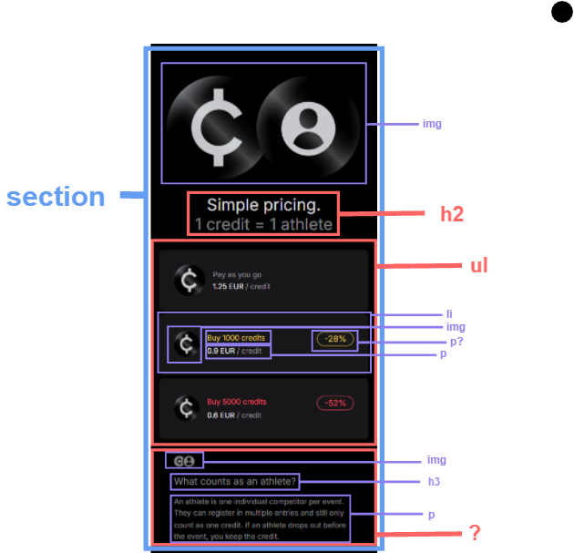
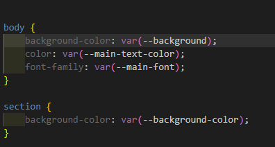
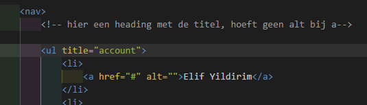
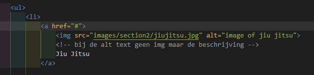

# Procesverslag
Markdown is een simpele manier om HTML te schrijven.  
Markdown cheat cheet: [Hulp bij het schrijven van Markdown](https://github.com/adam-p/markdown-here/wiki/Markdown-Cheatsheet).

Nb. De standaardstructuur en de spartaanse opmaak van de README.md zijn helemaal prima. Het gaat om de inhoud van je procesverslag. Besteedt de tijd voor pracht en praal aan je website.

Nb. Door *open* toe te voegen aan een *details* element kun je deze standaard open zetten. Fijn om dat steeds voor de relevante stuk(ken) te doen.

## Jij

  
uitwerken voor kick-off werkgroep

  ### Auteur:
  Elif Yildirim

  #### Je startniveau:
  Blauw/rood

  #### Je focus:
Responsive (en surface plane als er tijd voor is) 

## Je website

  
uitwerken voor kick-off werkgroep

  ### Je opdracht:
    https://smoothcomp.com/en
  #### Screenshot(s) van de eerste pagina (small screen): 
    Home pagina
 
Hier is content met linkjes naar andere pagina's
 

  #### Screenshot(s) van de tweede pagina (small screen):
    Detail pagina
 Hier begint de detail pagina
 Hier is wat tekst

## Toegankelijkheidstest 1/2 (week 1)

  
uitwerken na test in 2e werkgroep

  ### Bevindingen
  
  Mijn bevindingen die in de toegankelijkheidstest naar voren kwamen: 
  - Screanreader ging makkelijk aan. De toetsen die je moet gebruiken zijn makkelijk te vinden en begrijpen.
  - De stem van de screenreader is prima te volgen. 
  - De screenreader pakt alle headings en linkjes op de juiste volgorde. Als ik op 1 klik pakt die alle H1's en als ik 2 of 3 klik leest die de juiste bijhorende headings voor. 
  - Bij images zegt die unlabed graphic, dus de images hebben geen alt tekst waardoor ze niet toegankelijk zijn voor de screenreader. 
  - De screenreader geeft aan wanneer het een link is.
  
 Mijn bevindingen die in de WCAG checklist naar voren kwamen: 
  - De content van de website is makkelijk te begrijpen. Het is duidelijk dat de buttons buttons zijn. De screenreader laat goed weten wanneer iets een link is.
  - Bij het valideren van de code komen er veel errors uit. De site heeft een lang attribute en je kan de site overschakelen naar verschillende talen. De pagina's hebben geen unieke titel, tenminste er stond (toen ik het opzocht) aria-label: not specified. 
  - Bij tab en shift-tab is er een visuele element die zichbaar wordt.
  - De site kan geroteerd worden naar verschillende angles en de links hebben een goeie grootte en positie. 
  - De site heeft alleen maar div's. Geen lists. De headings staan elke keer bovenaan de div, dus heeft een logische volgorde. Het heeft op de home pagina twee H1's. 
  - De images hebben geen alt attribute. Het heeft geen text alternative voor complexere foto's. Er zijn twee images die tekst bevatten en die als button worden weergegeven, deze hebben wel een alt-text. 
  - De site heeft 1 video zonder audio. Het speelt automatisch. Je kan hem niet pauzeren of stoppen. 
  - De links hebben een a element. De links hebben een focus state. Sommige buttons hebben geen button element. De links hebben een icoon die verwijst dat je naar een andere pagina verstuurd gaat worden.
  - Ze gebruiken wel kleur, maar ze gebruiken ook veel vormen, plaatjes en tekst voor de informatie. Er is alleen een dark mode. 
  - Het heeft 1 animatie onderaan met de logo's van hun partners. Het is subtiel, maar ik kan niet vinden of het zich houdt aan de prefers-reduced-motion media query.
  - De color contrast is helemaal goed. 

  Vragen: 
  - "Provide a unique title for each page" -> is dit een H1?  -> antwoord: ja. Mijn website heeft dit niet!

## Breakdownschets (week 1)

  
uitwerken na afloop 3e werkgroep

  ### de hele pagina: 
https://miro.com/welcomeonboard/V1BSajh5eFZHUEVMTU5XdEZvb1ZranQwanlsZUEyQWlwdnh5ZE4wUWZzd2ZyN2s4ampNd0xRS1BaMkFuWkFRM2ZDQ3RzT042a1pVc3ZNSXJMZlFUa3lGSStGYlBsazVqVjFwR2R2aXVJOC9OeUU2TlhyUXFZM2c4S25mSUlpVXBzVXVvMm53MW9OWFg5bkJoVXZxdFhRPT0hdjE=?share_link_id=997982138408  Link naar mijn schets!  
Feedback op mijn breakdownschets:
- img wordt een a
- button een a
- in de header allleen de dingen die op elke pagina zijn; zoals de nav, maar de img met h1 niet
- voor hamburgermenu: nav/ul-/li/a en dan is het een button om alles open te doen
- header/logo/a/button en dan een nav
- van de homepage de logo de h1 maken of h1 toevoegen en die dan verbergen (want elke pagina moet een goeie h1 hebben)
- de h1 wordt een h2
- de buttons die ik had in de voormalige header moeten a's worden
- de kleine stuk in de h2 kan je strong gebruiken
- bij de eerste section met de ul: om het beter te maken kan je van de hele li een a maken
- van die ?: een nav met een ul en dan li
- tweede img: later met css komt de background img maar kan ook een img als ik met vol overtuiging het kan uitleggen
- bij de volgende ul: gewoon een li met een img. hoeft geen p
- bij de een na laatste kan ik een section in een section doen
- bij de footer moet de ul in een ul en daarna pas de li met a's
- maak ook ss van de andere states: bv hamburgermenu
- eerst de content en dan de img
- a href kan # gebruiken
- een link mag niet in een button en button niet in een link
- voor de nav om iets aan de linker kant te houden: margin-left:auto; 
- Voor bv img eerst en dan tekst: wel op de child
- flex-direction:column
- Content drie css bestanden: 1 voor algemene dingen; fonts etc 1 voor home 1 voor andere pagina

Dynamische deel (bijv menu) en andere dynamische delen (bijv filter) kan je ook in dezelfde Miro board zien.

## Voortgang 1 (week 2)

  
uitwerken voor 1e voortgang

  ### Stand van zaken

Ik wist soms niet wat voor code ik moest gebruiken voor specifieke content delen op mijn website. De foto hieronder is een voorbeeld. Ik kon maar niet vinden wat ik hier zou kunnen gebruiken, dus had het aan de 
studentassistent gevraagd en die zei dat ik een section in een section kon doen. 
  
Daarna was ik al een beetje begonnen met mijn CSS, maar het lukte me niet om m'n achtergrond kleur goed te krijgen. Ik speelde daar veel mee en kon niet de oplossing vinden, dus vroeg ik dit ook aan de studentassisten. Ik had eerst mijn background color op een * gedaan, omdat ik dacht dat ik toch alles moest selecteren, zij vertelden me dat ik het juist alleen op de body moest doen, zodat het niet letterlijk alles pakt (want dit was het geval). Toen ik dit veranderd had, kregen de section de juiste achtergrond kleur, precies wat ik wou!  

  ### Agenda voor meeting
Mijn groepje zijn de papegaaien!
Student 1 (Elif)
- Ik wil sowieso mijn HTML even laten checken
- Is mijn footer goed? 

De andere studenten vroegen vooral of de breakdownschets goed was en daar kregen ze veel feedback op.
Als tip gaven ze bijv. dat we de H1 niet moeten vergeten, de header niet moeten vergeten. En ze hadden het over detail summary, maar dat gebruikt mijn website niet..

  ### Verslag van meeting

- Een ul kan geen titel hebben. De titel uit de ul halen en buiten de ul zetten als een heading.
- Ik had bij m'n a's een alt text geschreven, maar dit hoeft helemaal niet zeiden de studentassistenten. Dus alle alt text bij de a's mogen weg.
- Bij de alt text van de images moet ik de tekst veranderen naar een betere beschrijving. Ik had eerst als text "image of judo", maar het woord image moet niet.
- Bij de footer had ik een ul in een ul, omdat ik dat als tip had gekregen van een andere assistente, maar deze keer zeiden ze dat ik beter een nav kan gebruiken en daarin drie sections met een heading daarbinnen, omdat elke stuk een titel heeft.
- En dan in de section een ul met daarin de li / a.
- Ook bij de footer kan ik de laatste lijst in een aparte (dus niet in de nav) ul doen met daarin (bij de laatste regel met de apps) een ul. Hierin komen de li met de img's.
- Over mijn fonts: ik had een bestand gevonden van de website waarin alle fonts stonden en ik kreeg als feedback te horen dat ik de gene die dubbel zijn eruit kan halen. Een nieuwe CSS bestand moet maken met daarin de fonts. fonts.css. @fontface en dan bij de headings aangeven font-family en font-weight.
- + de foto op m'n github veranderen naar eentje zonder een bullet point!

<!-- bij de tweede html pagina; input met radio buttons -->

## Voortgang 2 (week 3)

  
uitwerken voor 2e voortgang

  ### Stand van zaken
  dingen uitgeprobeerd, uitgezocht. 

  ### Agenda voor meeting

  Elke student wou eerst de html/breakdownschets laten checken
  We hadden het over een broodkruimelmenu, nav ul li a. Handig om te weten, maar was niet van toepassing voor mijn website! emmet cheat sheet, een super handige tool voor de shortcuts! line height in een ul, specifieke regels hoog. overflow hidden, scroll. dit maakt de lijst scrollbaar! background-image: linear-gradient () elke kleur op een nieuwe regel zodat je kan zien wat je hebt gedaan. gevraagd hoe ik de laatste li of img aan de zijkant krijgt als het scherm groter wordt en het antwoord staat hier beneden

  ### Verslag van meeting
  hier na afloop snel de uitkomsten van de meeting vastleggen

  - de nav en andere a's in m'n header moeten naar de main/style.css, omdat het ook op de andere pagina's voorkomt
  - gevraagd hoe ik de laatste li of img aan de zijkant krijgt als het scherm groter wordt 
  - we hebben het gehad over de gradient
  - extra content toevoegen zonder extra html
  - mask-image maakt een extra laag
  - en andere tips die ik kan gebruiken en die allemaal hieronder staan

  background-image: 
    linear-gradient (
      black 0,
      transparent 1em valc(100% - 1em),
      black
  );

  dit is een stukje waar je content mee kan toevoegen zonder je extra html ervoor typt
  ul::before {
    content:"hoofdstuk: ";
  }

  wat kleur heeft zie je wel en wat transparent is zie je niet, dit doet een mask.
  mask-image: linear-gradient (
    transparent,
    pink 1em valc(100% - 1em),
    transparent
  )
  dit zijn trouwens allemaal in de ul

  iets aanpassen als iets groter wordt
  img{
    max-width: 100% 
  } dit bij de main css, alle plaatjes worden nooit groter dan de container

  section{
    display:grid;
    justify-items: center;
  }

  section img {
    width: 50%;
  }

  als je scherm groter wordt, dan gebeurd er iets. en deze moeten allemaal onder staan in je css, want je begint met small screen, zet ze bij elkaar waar het over gaat.
  @media (width > 32em) {
    section {
      background-color: pink;
      grid-template-columns: 1fr 1fr;
    }
    section img {
      grid-column-start: 2;
      grid-column-end: 3;

      grid-row-start: 1;
      grid-row-end: 4;

  <!-- kan width als je wilt dat de img groter wordt -->
    align-self:center  }
  }

  position relative en absolute voor tekst op img veranderen naar display
  img {
    max-width: 100%;
  }

  section {
    position: relative;
  }

  h2 {
    position: absolute;
  }
  dit is 1 manier

  section {
    display: grid;
  }

  h2 {
    grid-column-start: 1;
    grid-row-start: 1;
    z-index: 1;

    align-self: end; dan gaat die naar de onderkant
  }

  img {
    grid-column-start: 1;
    grid-row-start: 1; 
  }
  en dit is een ander manier

## Toegankelijkheidstest 2/2 (week 4)

  
uitwerken na test in 9e werkgroep

  ### Bevindingen
  Lijst met je bevindingen die in de test naar voren kwamen (geef ook aan wat er verbeterd is):

## Voortgang 3 (week 4)

  
uitwerken voor 3e voortgang

  ### Stand van zaken
  css'en gaat goed. 

  ### Agenda voor meeting
  vragen: moeten de events in mijn tweede pagina alleen in een ul, of moet ik een ul in een ul hebben zodat ik de elementen kan display gridden? 
  ziet mijn html op de tweede er goed uit?

  ### Verslag van meeting

  dit is alles wat we besproken hebben:
  - flexbox gebruiken ipv grid voor elementen die naast/onder elkaar staan (bij mark z'n website)
  - vergeet dark light mode niet
  - ik hoef de img niet te editten voor light mode, gewoon achtergrond veranderen en misschien letters
  - je moet weten hoe je screenreader werkt; stem veranderd. hij gaat vragen hoe je alleen heading laat voorlezen
  - je moet code kunnen uitleggen; notes met onderbouwing is handig
  - vergeet github niet
  - hier moet een heading komen en dan met css verbergen. bij elke section MOET er een heading komen
  - value hoeft niet, placeholder in html
  - search element? zoek op 
  - dat sorteer filter hoeft niet, visueel wel maken maar hoeft niet werkend
  - de a om de hele li, en img kan niet in de h4, beter cssen met display inline op het plaatje en de h4 kan helemaal weg, moet p zijn
  

## Eindgesprek (week 5)

  
uitwerken voor eindgesprek

  ### Je uitkomst - karakteristiek screenshots:
  

  ### Dit ging goed/Heb ik geleerd: 
  Korte omschrijving met plaatjes

  

  ### Dit was lastig/Is niet gelukt:
  Korte omschrijving met plaatjes

  

## Bronnenlijst

  
continu bijhouden terwijl je werkt

  Nb. Wees specifiek ('css-tricks' als bron is bijv. niet specifiek genoeg). 
  Nb. ChatGpT en andere AI horen er ook bij.
  Nb. Vermeld de bronnen ook in je code.

  1. bron 1
  2. bron 2
  3. ...

